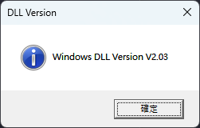
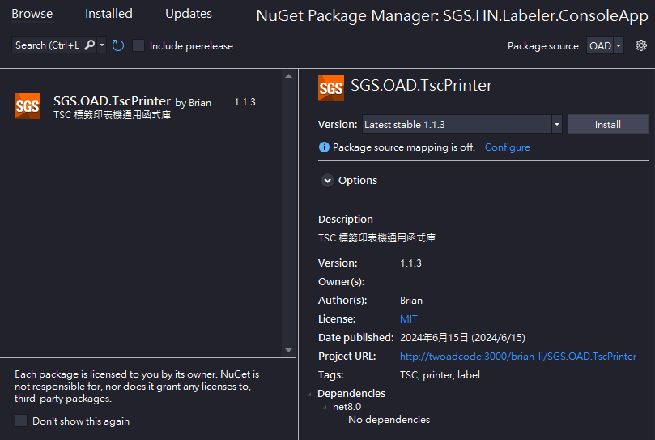
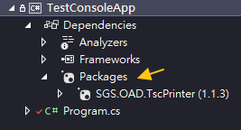

 
 
 


# 📦SGS.LIB.TscPrinter

- 封裝 TSC 標籤印表機函式庫，方便快速測試與開發標籤列印應用
- 以 NuGet 套件形式封裝，可透過 Visual Studio 進行安裝、管理
- 部署在公司內部環境，新增 NuGet 來源即可使用

## 🛠️事前準備

- 一台標籤印表機
- 一綑標籤紙
- 安裝驅動程式 https://usca.tscprinters.com/en/downloads
- 本套件已包含 TSCLIB.dll，版本如下



## 🔧安裝套件

新增 NuGet 來源，即可於 Visual Studio 內安裝

### 新增 NuGet 來源

#### 於 Visual Stdio 加入

- Tools > Options > NuGet Package Manager > Package Sources > +
- 填寫 Name 與 Source `\\twfs007\SGSSHARE\OAD\nuget\`

#### 使用 nuget.config

於方案(solution)根目錄新增一個檔案 `nuget.config`，內容為 `xml`

```xml
<?xml version="1.0" encoding="utf-8"?>
<configuration>
  <packageSources>
    <add key="OAD" value="\\twfs007\SGSSHARE\OAD\nuget\" />
  </packageSources>
</configuration>
```
檔案結構舉例

```powershell
📁solution
    📄*.sln
    📄nuget.config #放在這裡
    📁.git
    📁project 1
    📁project 2
    ...
```

### 安裝 Nuget Package

完成上述來源設定後，即可透過 Nuget Package Manger 安裝



安裝完畢後，專案應該會長這樣



## ✅測試套件

```csharp
using SGS.OAD.TscPrinter;

TSC.About();
```

- 可使用 Console 專案進行簡單測試
- `About()` 如呼叫成功，應會顯示以下視窗


## 🖨️列印範例

- 以 LIMS 標籤格式一為例，示範列印程式碼
- 格式一為一式兩張標籤紙，長寬設定為 73mm x 15mm
- 如非上述格式請務必自行調整參數

```csharp
// 初始化標籤機
TSC.Build("填寫印表機名稱", 73, 15);

// 設定列印內容
// 此段請依照實際需求調整，列印資料與位置不一
// 詳見測試專案 TestConsoleApp > Program.cs

// 列印標籤
TSC.Print();
// 釋放資源
TSC.Dispose();
```